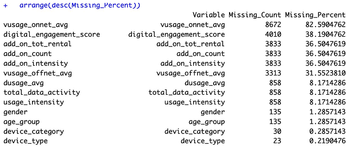
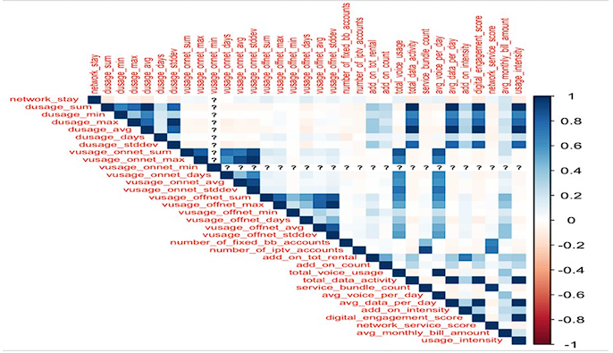
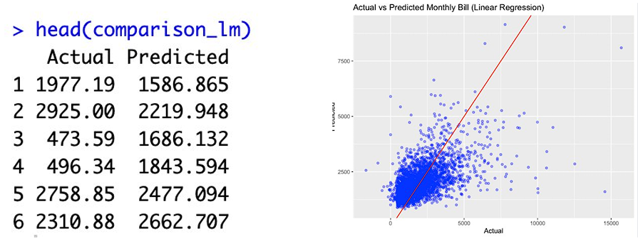
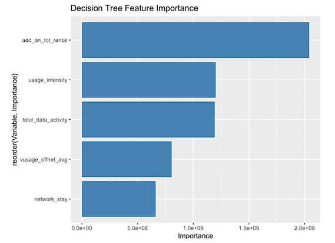
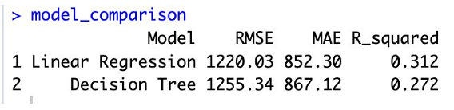

# Telecom Customer Bill Prediction using R

## Project Overview

This project applies exploratory data analysis and predictive modelling techniques to a telecommunications customer dataset. The main objective is to identify the key drivers of customer monthly billing and compare different predictive modelling approaches for business decision-making.

The analysis was conducted using RStudio and includes data exploration, missing value treatment, outlier analysis, feature selection, regression modelling, decision tree modelling, model comparison, and business recommendations.

## Business Problem

Telecommunications companies need to understand what factors influence customer monthly billing. By identifying the strongest billing drivers, the business can improve revenue forecasting, customer segmentation, pricing strategy, and targeted marketing.

This project aims to answer:

- Which customer behaviour variables are most strongly related to monthly billing?
- How should missing values and outliers be handled before modelling?
- Which predictive model is more suitable for monthly bill prediction?
- What business recommendations can be made from the modelling results?

## Dataset

The dataset contains telecommunications customer data with customer usage behaviour, service subscription information, demographic variables, and billing information.

Key dataset characteristics:

- 10,500 customer observations
- 38 variables
- Mixture of numerical, categorical, ordinal, and binary variables
- Target variable: average monthly bill amount

## Tools and Technologies

- R
- RStudio
- dplyr
- ggplot2
- caret
- rpart
- Exploratory Data Analysis
- Correlation Analysis
- Regression Modelling
- Decision Tree Modelling

## Methodology

The project followed a structured predictive analytics workflow:

1. Data type classification and variable understanding
2. Categorical variable transformation
3. Exploratory data analysis
4. Missing value analysis
5. Outlier detection
6. Correlation analysis and feature selection
7. Multiple linear regression modelling
8. Decision tree regression modelling
9. Hyperparameter experimentation
10. Model comparison and business recommendation

## Exploratory Data Analysis

The exploratory analysis found that many usage-related variables were positively skewed. This suggests that most customers had moderate usage levels, while a smaller group of heavy users showed extremely high usage behaviour.

Several variables also contained missing values, including voice usage, add-on service, and digital engagement variables. Three missing value treatment methods were compared:

- Listwise deletion
- Median imputation
- KNN imputation

Median imputation was selected as the preferred approach because it preserved the statistical properties of the dataset, handled skewed variables effectively, and was more computationally efficient than KNN imputation.

## Feature Selection

Correlation analysis and Variance Inflation Factor checking were used to reduce redundancy and multicollinearity.

The strongest billing-related predictors included:

- Total data activity
- Add-on total rental
- Usage intensity
- Off-network voice usage
- Network stay

The feature selection process reduced the number of numerical predictors from 33 to 20, improving model interpretability and reducing unnecessary complexity.

## Predictive Models

Two models were developed and compared.

### Multiple Linear Regression

The regression model was built to predict customer monthly billing using selected predictors.

Performance:

- R-squared: 0.312
- Adjusted R-squared: 0.299
- RMSE: 1220
- MAE: 852

The model showed that customer billing is mainly influenced by data activity, add-on service rental, usage intensity, network tenure, and off-network voice usage.

### Decision Tree Regression

A decision tree regression model was also developed to provide a more interpretable, rule-based view of customer billing behaviour.

Performance:

- R-squared: 0.272
- RMSE: 1255
- MAE: 867

The decision tree showed that add-on total rental was the most important splitting variable, followed by usage intensity, total data activity, off-network voice usage, and network stay.

## Model Comparison

The regression model achieved slightly better predictive performance than the decision tree model, with lower RMSE and MAE and a higher R-squared value.

However, the decision tree was useful for business interpretation because it provided clear decision rules and helped explain how different customer groups were associated with different billing levels.

## Business Recommendation

The linear regression model is recommended as the primary model for customer bill prediction and revenue forecasting because it provides better predictive accuracy and clear statistical interpretation.

The decision tree model should be used as a supporting model for customer segmentation, marketing insights, and explaining customer billing behaviour to non-technical stakeholders.

## Key Business Insights

- Add-on service rental is one of the strongest drivers of monthly billing.
- Customers with higher usage intensity tend to generate higher monthly bills.
- Data activity is strongly related to billing behaviour.
- Off-network voice usage may increase customer billing due to additional usage charges.
- Decision trees can help translate model outputs into simple business rules.

## Future Improvements

Future versions of this project could improve model performance by:

- Testing log transformation for skewed variables
- Applying robust regression
- Comparing random forest and gradient boosting models
- Conducting cross-validation
- Creating an interactive dashboard for billing insights
